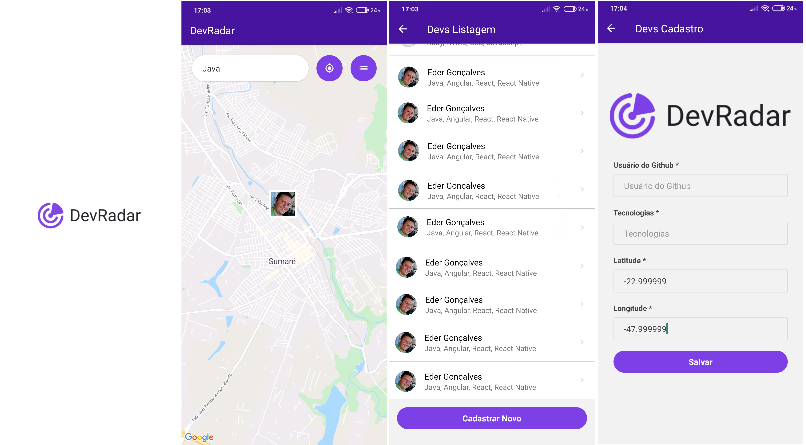

<h4 align="center">
    
     
    <b>Conecte a DEVs proximos!</b> 🦸‍
</h4>
<h2 align="center">
     
  🚀 Semana Omnistack 10.0
</h2>

## 💻 Projeto (Node.js, ReactJS e React Native)
Aplicação com intuito de conectar pessoas interessadas nas mesmas tecnologias.

# Fui além do desafio!

💻 Adicionei Tela de Listagem de desenvolvedores

💻 Adicionei Tela de Cadastro e Edição dos devs com opção de atualizar localização em tempo real via mobile

💻 Customização no retorno de mensagens ao usuario usando Flash Message para erros e alertas

💻 Prettier para padronizar o código 

💻 Deploy do backend no Google Cloud Platform (GCP), e usando MongoDB Atlas Online (NOSQL database)

## :camera: Veja:

### Mobile

## :rocket: Tecnologias

<table>
  <thead>
    <th>Back-end</th>
    <th>Front-end</th>
    <th>Mobile</th>
  </thead>
  <tbody>
    <tr>
      <td>NodeJS</td>
      <td>ReactJS</td>
      <td>React Native</td>
    </tr>
    <tr>
      <td>ExpressJS</td>
      <td>Prettier</td>
      <td>Expo</td>
    </tr>
    <tr>
      <td>Mongoose</td>
      <td>Axios</td>
      <td>Axios</td>
    </tr>
    <tr>
      <td>Nodemon</td>
      <td>React Dom</td>
      <td>React Native flash message</td>
    </tr>
    <tr>
      <td>Cors</td>
      <td>React Scripts</td>
      <td>React Native gesture handler</td>
    </tr>
    <tr>
      <td>Socket.io</td>
      <td>Jest</td>
      <td>React Native Maps</td>
    </tr>
  </tbody>
</table>
